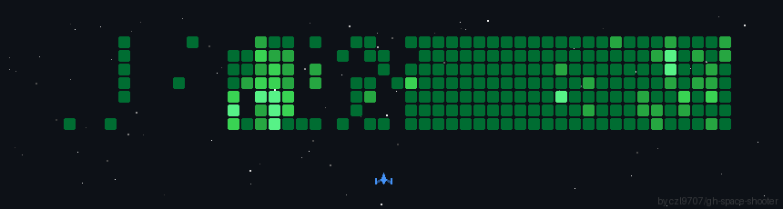

# Hi, I'm Trần Thế Pháp 👋

### Full-stack engineer · DevOps enthusiast · AI builder

I enjoy turning ideas into reliable software — from polished web experiences and backend systems to automated delivery pipelines and AI-powered solutions.

  
  
  

## 👨‍💻 About me

- Started programming at 18 and have been learning by building ever since.
- Interested in full-stack product development, DevOps, cloud infrastructure and AI.
- I value clean interfaces, maintainable systems and automation that makes teams faster.
- Always open to interesting ideas, technical conversations and collaboration.

## 🧭 What I work on

| Area | What it means to me |
| --- | --- |
| **Full-stack development** | Building responsive frontends, robust APIs and end-to-end product experiences. |
| **DevOps & cloud** | Improving delivery with CI/CD, containers, deployment automation and observability. |
| **AI-powered solutions** | Exploring practical ways to use AI to make software more useful and future-ready. |

## 🛠️ Tech stack

### Languages

### Frontend & backend

### Data, cloud & tools

<em>Also familiar with:</em> AssemblyScript · Sequelize · Render · ESLint

## 📊 GitHub at a glance

  
  

## 🎮 Contribution journey

  

  <picture>
    <source media="(prefers-color-scheme: dark)" srcset="https://raw.githubusercontent.com/lethanhan01/lethanhan01/output-pacman/pacman-contribution-graph-dark.svg" />
    <source media="(prefers-color-scheme: light)" srcset="https://raw.githubusercontent.com/lethanhan01/lethanhan01/output-pacman/pacman-contribution-graph.svg" />
    
  </picture>

  

### Thanks for stopping by ✨

If something here catches your eye, feel free to connect or start a conversation.

